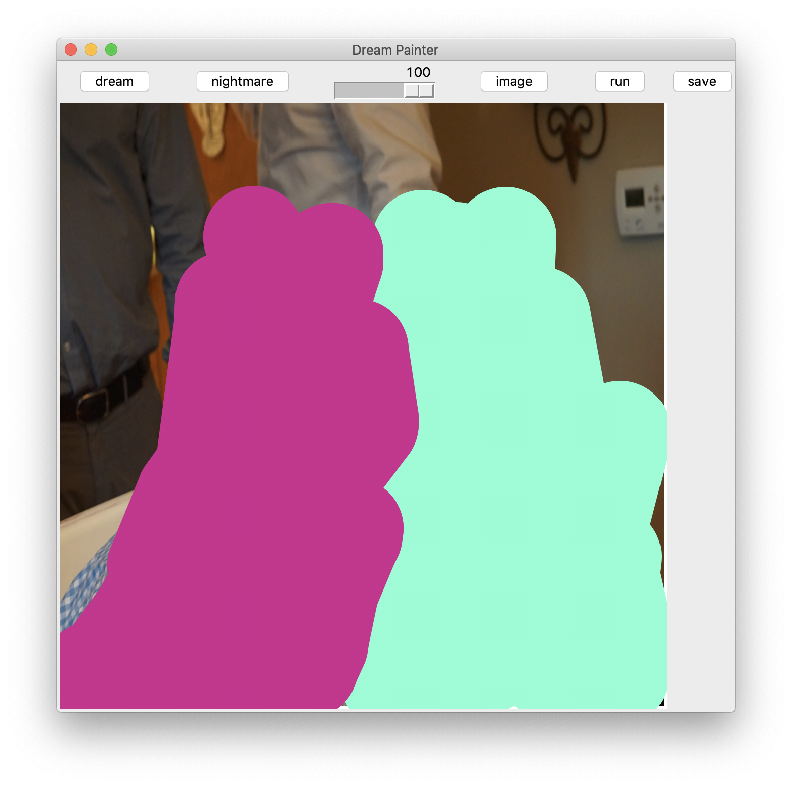

# Dream Painter (Media Art Design and Practice Midterm)

## Description 

Dream Painter is a paint application made in Python. The user selects an image to edit and can chose between "dream" and "nightmare" modes. In dream mode, the user can draw over the image to indicate which parts of the image will be DeepDreamed. DeepDream uses a convolutional neural network to enhance object patterns it detects in the image, giving it a dream-like appearance. The nightmare mode applys a filter to the image which gives it a glitchy appearance. To use the program, simply run `main.py`. Runtime will be slow, especially in dream mode.

## References
https://www.tensorflow.org/tutorials/generative/deepdream
https://gist.github.com/nikhilkumarsingh/85501ee2c3d8c0cfa9d1a27be5781f06

## Dependencies 

* tensorflow
* numpy
* cv2
* tkinter

